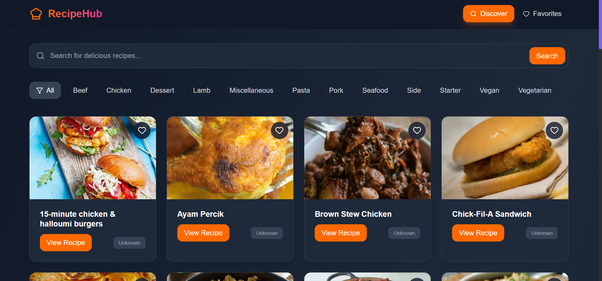
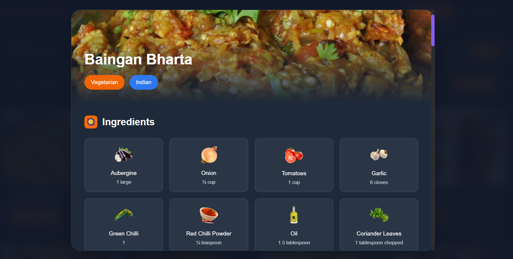
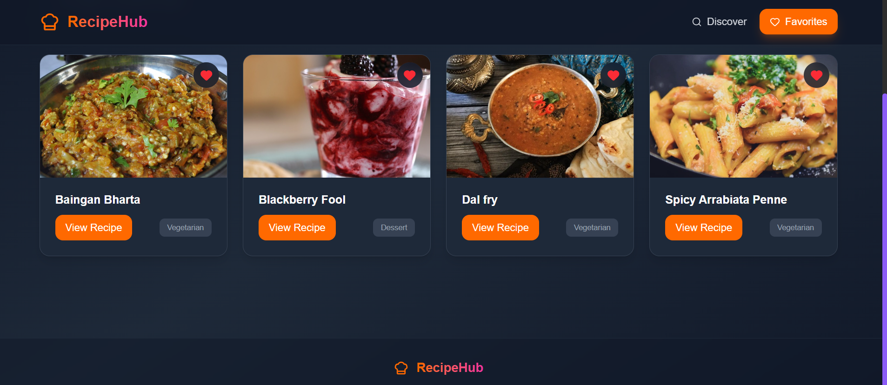
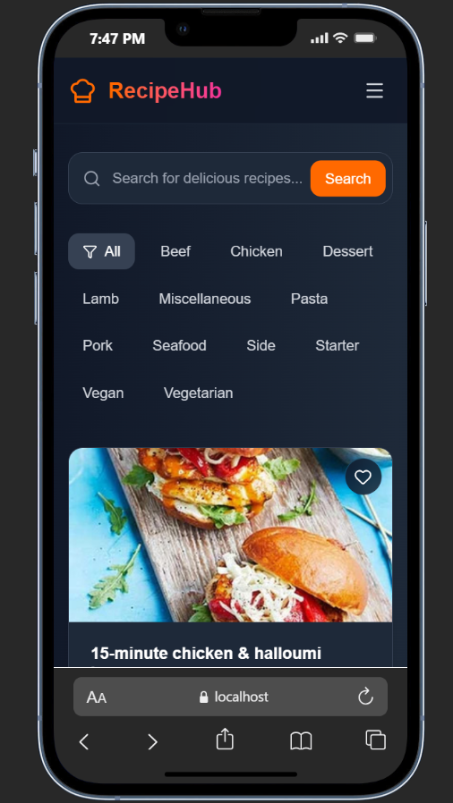

# 🍳 RecipeHub

A modern, responsive recipe application built with **React** that lets you discover, search, and save your favorite recipes from around the world.  
Beautiful **dark-themed UI** with smooth animations, smart search, and local storage for favorites.  

---

## 🚀 Live Demo

🔗 [Try RecipeHub Here](https://recipe-hub-preetam.vercel.app/)

---

## ✨ Features

- 🔍 **Smart Search** – Search recipes by name or ingredients  
- 📂 **Category Filtering** – Browse recipes by categories (Beef, Chicken, Dessert, etc.)  
- ❤️ **Favorites System** – Save and manage your favorite recipes  
- 📱 **Responsive Design** – Works seamlessly on desktop, tablet, and mobile  
- 🎨 **Modern UI** – Dark theme with gradients and subtle animations  
- 📖 **Detailed Views** – Full recipe details with ingredients + step-by-step instructions  
- 🔗 **External Links** – Direct links to YouTube tutorials & original sources  
- 💾 **Local Storage** – Favorites persist in your browser  

---

## 🛠️ Tech Stack

- **Frontend**: React 18, Tailwind CSS  
- **Icons**: [Lucide React](https://lucide.dev) / custom SVG  
- **API**: [TheMealDB](https://www.themealdb.com/api.php)  
- **Storage**: Browser Local Storage  
- **Build Tool**: Create React App  

---
## 📸 Screenshots

### 🏠 Homepage

### 🔍 Search Recipes

### ❤️ Favorites Page

### 📱 Mobile View

---

